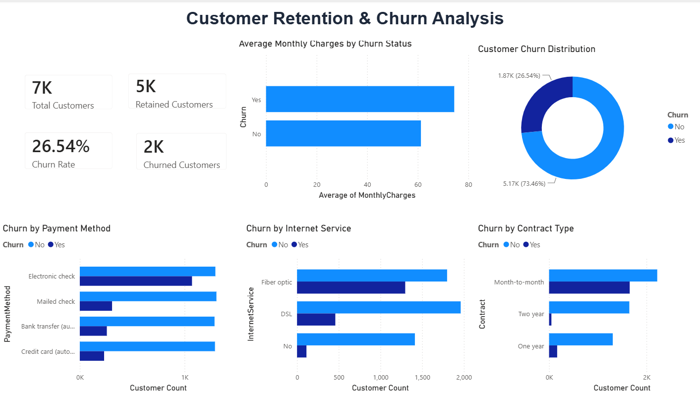

# 📊 Customer Retention & Churn Analysis

---

## 📌 Project Overview

This project was developed as part of the **Future Interns – Data Science & Analytics Internship (Task 2).**

The objective of this project is to analyze customer retention and churn behavior using Power BI. The dashboard provides insights into customer churn patterns, retention trends, contract types, internet services, payment methods, and monthly charges to support business decision-making and improve customer retention.

---

## 🎯 Objectives

- Analyze customer churn rate
- Identify retained and churned customers
- Compare churn across different contract types
- Analyze churn by internet service
- Evaluate churn by payment method
- Compare average monthly charges of retained and churned customers
- Build an interactive customer retention dashboard
- Generate business insights and recommendations

---

## 🛠️ Tools Used

- Microsoft Power BI
- Microsoft Excel / CSV
- GitHub

---

## 📈 Key Performance Indicators (KPIs)

- 👥 Total Customers
- ✅ Retained Customers
- ❌ Churned Customers
- 📉 Churn Rate

---

## 📊 Dashboard Visuals

- Customer Churn Distribution
- Average Monthly Charges by Churn Status
- Churn by Contract Type
- Churn by Internet Service
- Churn by Payment Method
- KPI Summary Cards

---

## 🔍 Key Insights

- Total customers analyzed: **7,043**
- Customer churn rate is **26.54%**.
- Around **73.46%** of customers were retained.
- Customers with **Month-to-Month contracts** have the highest churn rate.
- **Fiber Optic** users show higher churn compared to DSL customers.
- Customers with higher monthly charges are more likely to churn.
- Payment method also has an impact on customer retention.

---

## 💡 Recommendations

- Encourage customers to switch from Month-to-Month to long-term contracts.
- Improve customer engagement for Fiber Optic users.
- Introduce loyalty programs for long-term customers.
- Review pricing strategies for customers with higher monthly charges.
- Monitor churn trends regularly using business dashboards.

---

## 🖼️ Dashboard Preview

---

## 📂 Project Files

- `FUTURE_DS_02.pbix`
- `Dashboard.png`
- `README.md`

> **Note:** The original dataset is not included in this repository due to GitHub file size limitations.

---

## 📚 Dataset

**Dataset Used:** Telco Customer Churn Dataset

Source: Kaggle

https://www.kaggle.com/datasets/blastchar/telco-customer-churn

---

## 👨‍💻 Internship

**Future Interns – Data Science & Analytics Internship**

**Task 2: Customer Retention & Churn Analysis**
